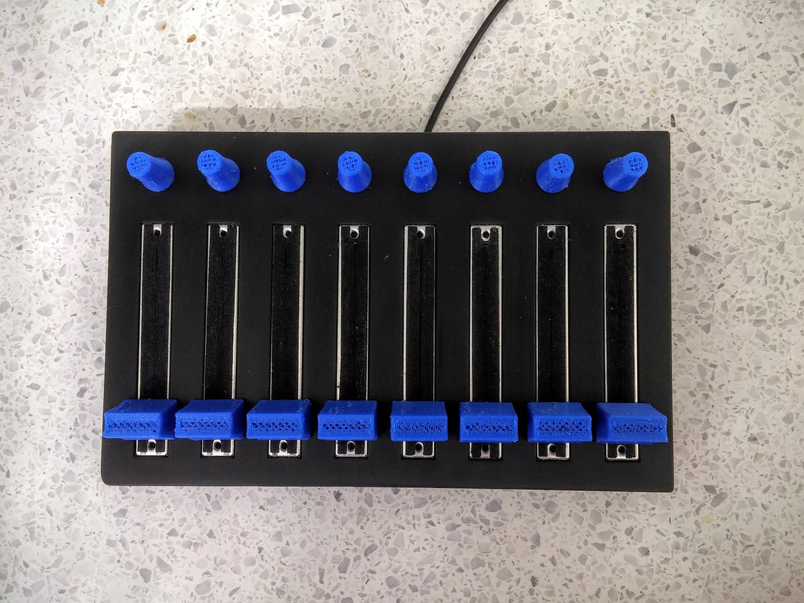
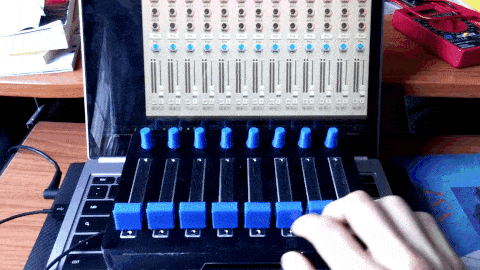
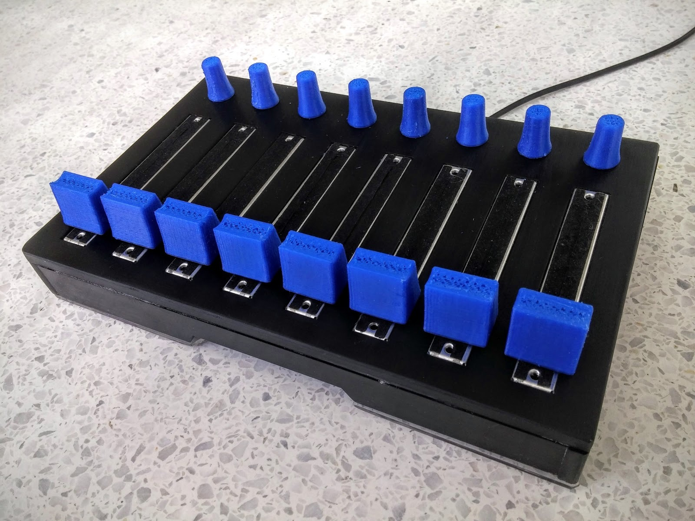
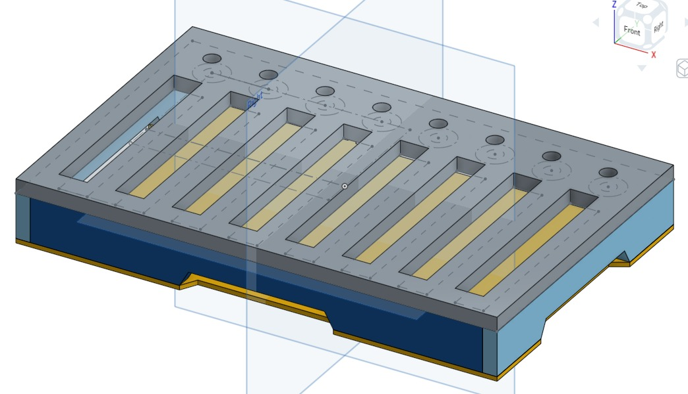
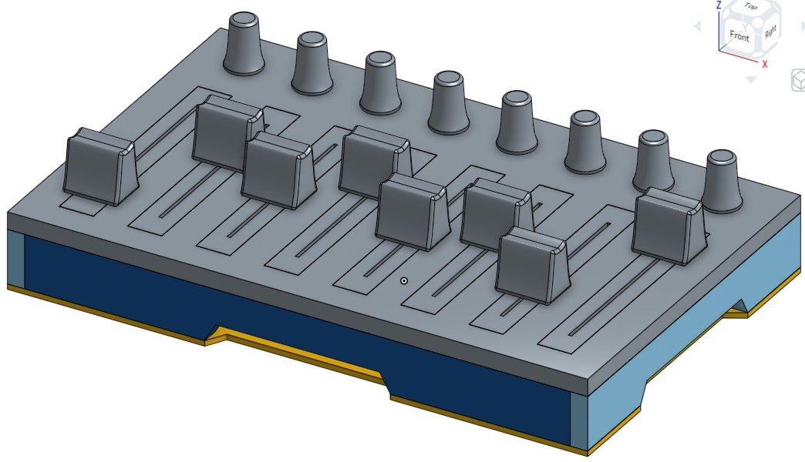
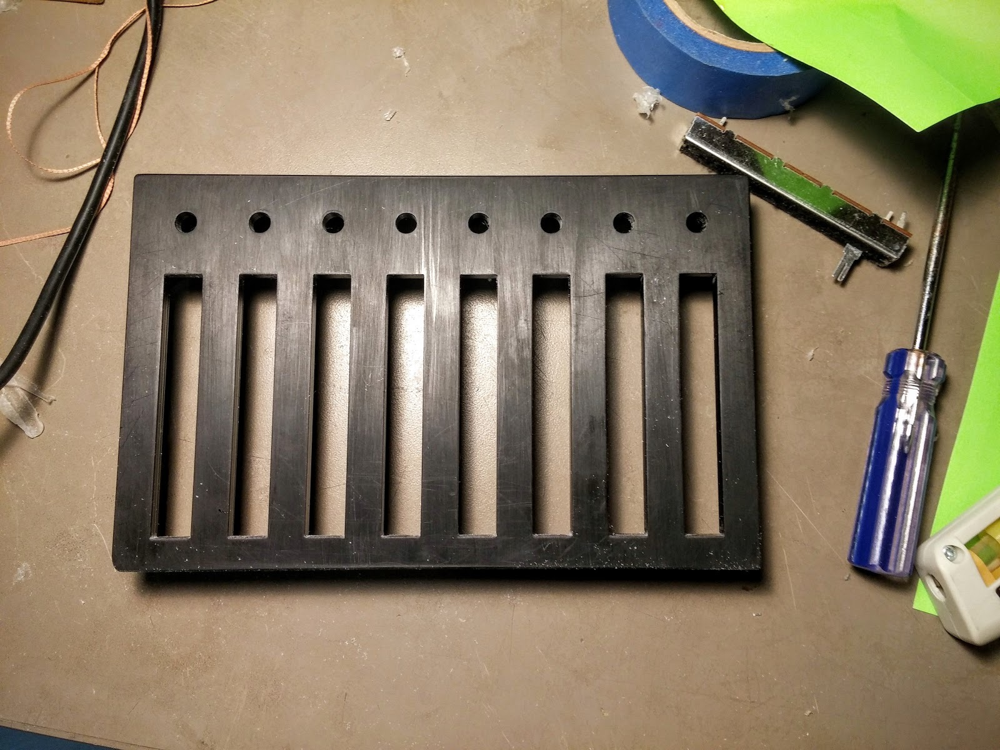
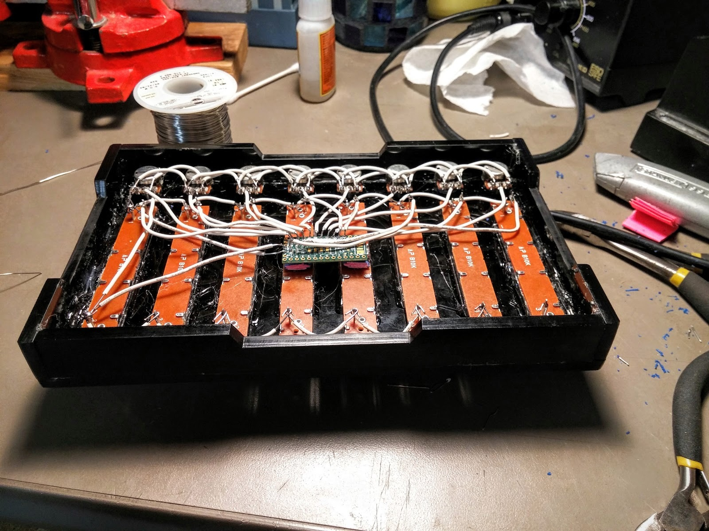
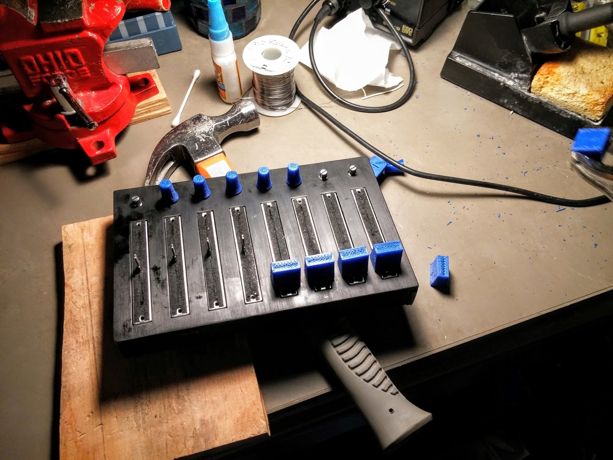

# Mixer

For an assignment on fabrication methods, I designed and built an analog MIDI controller with 8 knobs and 8 sliders, using Computer Aided Design, laser cutting, and 3D printing.

[Read the Writeup](https://docs.google.com/document/d/17EeCE5cnWYPYfy-mMV8Jlubh-wPYbIRkHEhIJLNOey4/edit)

---

## Behind the Scenes

Dimensions: 220mm x 140mm x 45mm

Weight: About 250g

Analog Resolution: 1024 levels

Sample Rate: More than 60Hz

Material cost: Less than $70

---

Assignment for: MAS.330 Design Across Scales

Learning Focus: Music Interfaces, Product Design, Computer Aided Design, Laser Cutting, 3D Printing, Microcontroller Programming

Media: MIDI Controller, Physical Interface, Object

Software: OnShape, C++

Hardware: Laser Cutter, 3D Printer, Machine Shop Tools, Teensy

Date: March 2016
